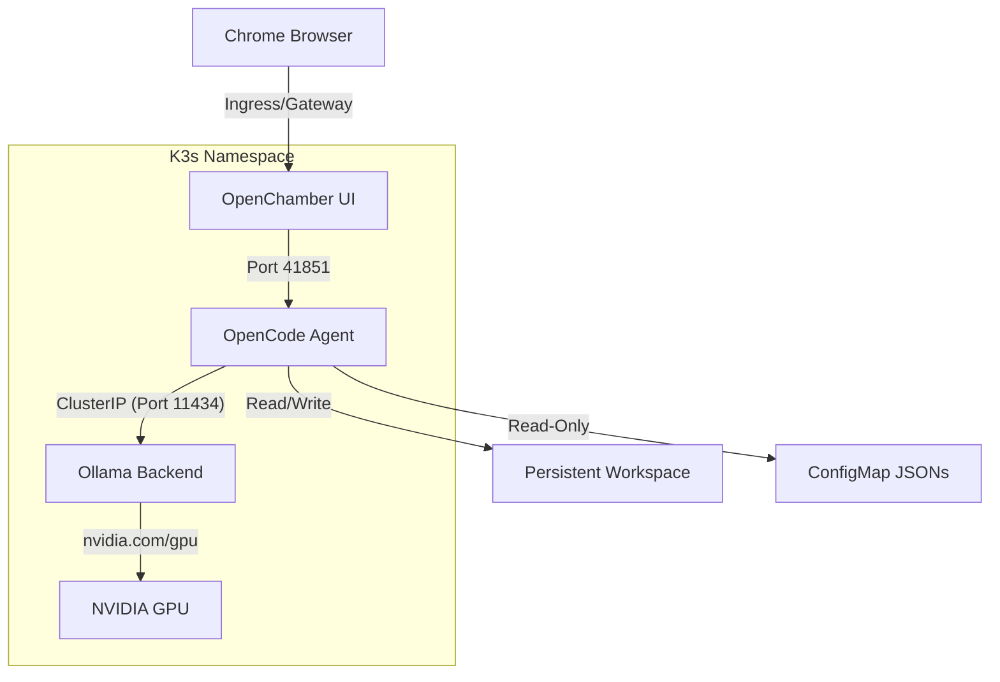

# OpenCode Container

This repository contains a containerized version of [OpenCode](https://github.com/openchamber/openchamber), exposing OpenCode and other AI agents via a web interface.

It includes a complete set of command-line tools commonly used alongside these agents, such as `gh`, `kubectl`, `jq`, `yq`, and `dyff`. The repository also provides a Helm chart to deploy the application easily into a Kubernetes environment with persistent storage for agent configuration files.

## Features
- **Docker Image**: Bundles `node`, `openchamber`, `opencode`, GitHub CLI, and various system utilities.
- **High-Performance K3s Integration**: Optimized for K3s clusters with GPU support and integrated Ollama backend.
- **Sticky Configurations**: Mount custom `opencode.json` and `settings.json` via ConfigMaps to ensure settings are preserved.
- **CI/CD**: Fully automated Nightly & Release pipelines via GitHub Actions.
- **Rootless & Secure**: Designed with best practices, avoiding Alpine in favor of `node:22-bookworm-slim` for broader compatibility, and utilizing read-only ServiceAccounts for `kubectl`.

## High-Performance K3s Architecture

This project is tailored for a specific high-performance use case: running OpenCode on a K3s cluster with local GPU nodes (e.g., RTX 4090) and an integrated Ollama backend in the same namespace.



## Usage

### Running with Docker (Local)

You can run the container directly using Docker. This is useful for local testing or for mobile device access via a simple container runner.

```bash
docker run -d \
  --name opencode \
  -p 3000:3000 \
  -e UI_PASSWORD=your-secure-password \
  -e OLLAMA_HOST=http://host.docker.internal:11434 \
  -v ./workspace:/home/opencode \
  ghcr.io/ryanbeales/opencode-container:latest
```

> [!TIP]
> Use `host.docker.internal` if your Ollama instance is running on the host machine.

## Deployment (K3s + GPU)

The provided Helm chart is designed for a unified deployment of both the agent and the Ollama backend.

### Example `values.yaml` for GPU Nodes

```yaml
replicaCount: 1

# Ensure the agent runs on the node with the GPU
nodeSelector:
  gpu-node: "true"

ollama:
  enabled: true
  resources:
    limits:
      nvidia.com/gpu: 1

persistence:
  enabled: true
  size: 50Gi
  storageClass: "crobasaurus-nfs"

config:
  opencodeJson: |
    {
      "model": "ollama/gpt-oss:20b",
      "enabled_providers": ["ollama"]
    }
```

### Installation

```bash
helm install opencode ./charts/opencode -f values.yaml
```

## Development

- Local tests exist for verifying Docker image integrity (`tests/test_docker.sh`).
- Use `helm lint charts/opencode` to verify chart correctness.
- The `entrypoint.sh` includes "No-Overwrite" logic to ensure that ConfigMap-mounted files or existing PV data are strictly preserved.
